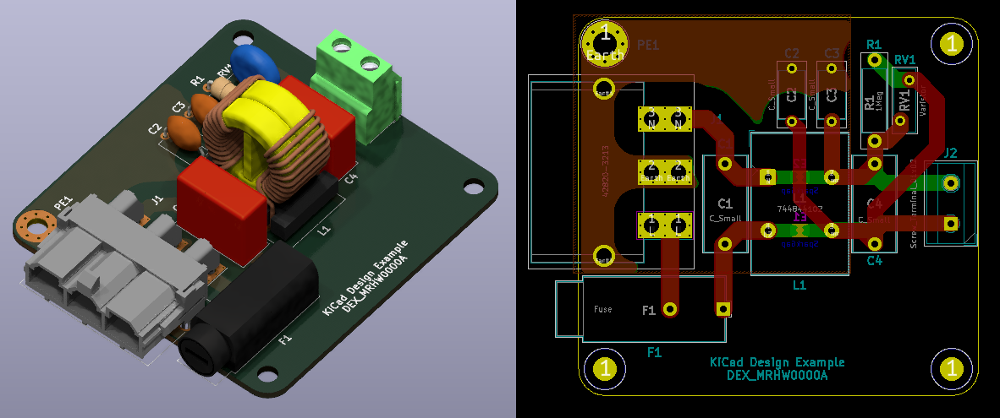
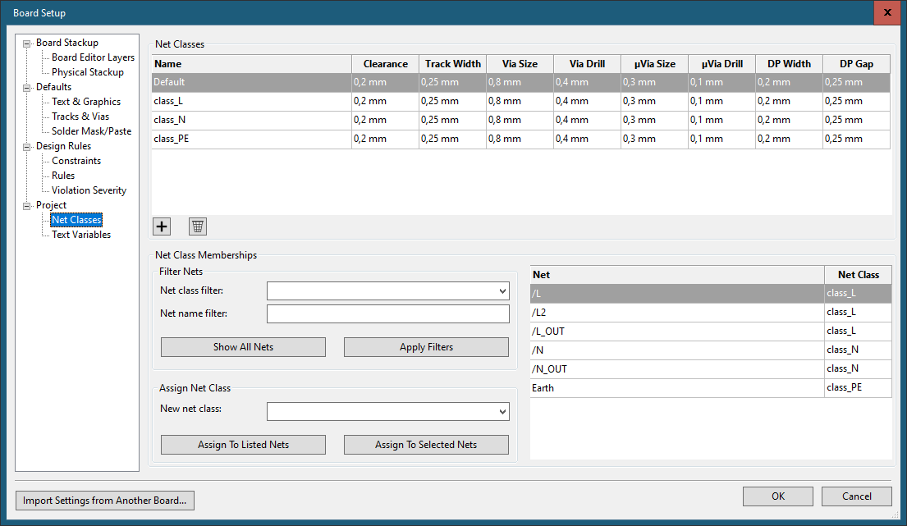
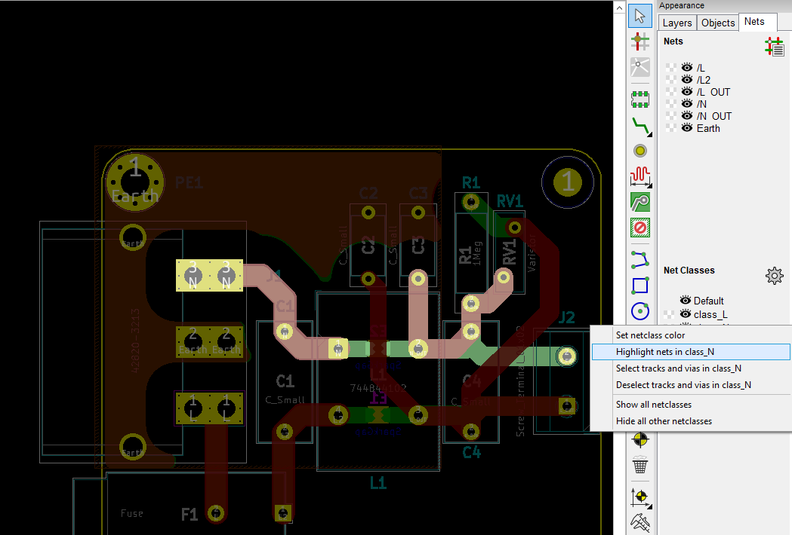

# DEX_MRHW0000 - basic line filter

A simple line filter circuit implements individual clearances for phase-to-neutral, mains-to-earth, and earth to PCB edge, as well as small self-clearance for nets that share the same DC potential, but may be split to account for AC behavior, in this case of a common-mode choke.

## Schematic

## Net Classes

The Net Classes panel is used to 

- declare net class names, 
- set basic net class values and
- assign each net in the schematic a class.

Clearance values given here can be superseded by rules written in Design Rules > Rules.

## Clearance Rules

When specifying only a basic clearance value in the Net Classes table, this value becomes the distance any net item (track segment, pad, ...) must keep  form items in other nets, no matter the net class. Between two items of net classes with differing clearance requirements, the larger clearance is applied. 

An equivalent rule for class_x with 0.2mm clearance has the form

	(rule "class_X"
	    (condition "A.NetClass == 'class_X'")
	    (constraint clearance (min 0.2mm)))

Such a rule written in Design Rules > Rules supersedes the implicit definition through the Net Classes table, but is functionally equivalent until the boolean expression is extended. The Net Classes table values cover all cases not otherwise described in the design rules script.

The distinction between same-class nets and other-class net clearances is made by extending the boolean expression and adding a complementary rule. A and B are the corresponding board items between which the clearance resolution is determined. 

	(rule "N_mutual_clearance"
	    (condition "A.NetClass == 'class_N' && B.NetClass != A.NetClass")
	    (constraint clearance (min 3.0mm)))
	
	(rule "N_self_clearance"
	    (condition "A.NetClass == 'class_N' && B.NetClass == A.NetClass")
	    (constraint clearance (min 0.75mm)))

Finally, order-of-evaluation need to be kept in mind. In the example below, clearance rules r1-r6 are thought to be written in ascending order, which leads to a chevron stack pattern in the associated clearance matrix. r1, r3, r5 are mutual clearance rules, r2, r4, r6 are same-class clearance rules (later: *_self_clearance):

	step 1:					step 2:					step 3:
		X	Y	Z			X	Y	Z			X	Y	Z
	X		r1	r1		X	r2	r1	r1		X	r2	r3	r1
	Y	r1				Y	r1				Y	r3		r3	
	Z	r1				Z	r1				Z	r1	r3	

	step 4:					step 5:					step 6:
		X	Y	Z			X	Y	Z			X	Y	Z
	X	r2	r3	r1		X	r2	r3	r5		X	r2	r3	r5
	Y	r3	r4	r3		Y	r3	r4	r5		Y	r3	r4	r5	
	Z	r1	r3			Z	r5	r5			Z	r5	r5	r6

The roles of A and B in the rule description can be swapped, which makes the clearance matrix symmetric, so it's usually only given in triangle form. 

### Clearance Rules For This Design

Please see the project files for the full list of rules. An excerpt is given below.

    # Project Rules
    #
    # Phase is segmented to insert a fuse holder and one winding of a common-mode filter choke.
    # A spark gap is inserted across the filter winding to prevent insulation breakdown in 
    # the event of a transient overvoltage condition. The same concept is applied to neutral.
    #
    # Clearance Matrix equivalent:
    #
    #			class_L		class_N		class_PE
    #	class_L		0.75mm		3.0mm		4.5mm
    #	class_N				0.75mm		4.5mm
    #	class_PE					0.2mm*
    #
    # * Note there is only PE_mutual_clearance for clearance to other nets, so class_PE self-clearance
    #   defaults to 0.2mm from Project > Net Classes.

## Net Class Inspection

All members of a net class can be highlighted by using the right-click option "Hightlight nets in <class>" of a class listed in Appearance > Nets > Net Classes: 

---
This project is art of a set of design examples. See [https://github.com/MisterHW/KiCad-Design-Examples/](https://github.com/MisterHW/KiCad-Design-Examples/) for more.
